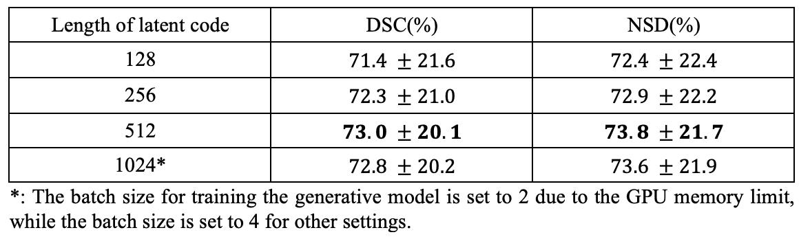

# LatenTrans

### Dataset
#### Lung Lesion Segmentation
- COVID-19-CT-Seg: [link](https://zenodo.org/record/3757476#.Xpz8OcgzZPY)
- MosMedData: [link](https://github.com/neuro-ml/COVID-19-Triage)
- MSD Lung Tumor: [link](http://medicaldecathlon.com/)
- NSCLC Pleural Effusion: [link](https://wiki.cancerimagingarchive.net/pages/viewpage.action?pageId=68551327)

#### Brain Tumor Segmentation
- Original CE-MRI: [link](https://figshare.com/articles/dataset/brain_tumor_dataset/1512427)
- Pre-processed Brain dataset can be downloaded from the [link](https://drive.google.com/file/d/10N1VmbuVZat6oZSrLwKFsyioFcQ7tcpL/view).

  

### Parameter Analysis
- The length of the latent code is set to 512 following the hyper-parameters in the official implementation of SEAN [link](https://github.com/ZPdesu/SEAN).

    

